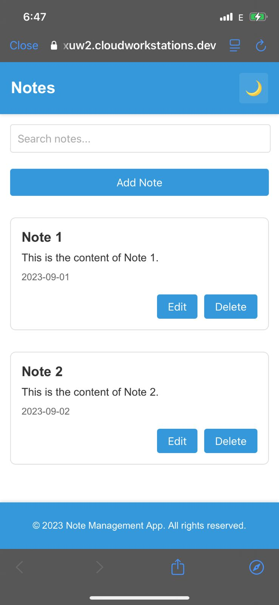
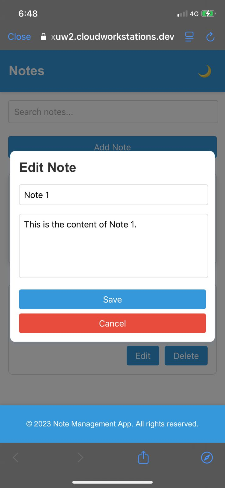
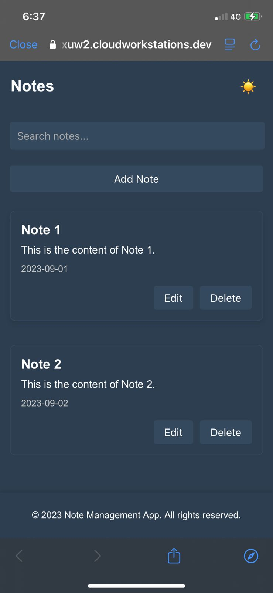
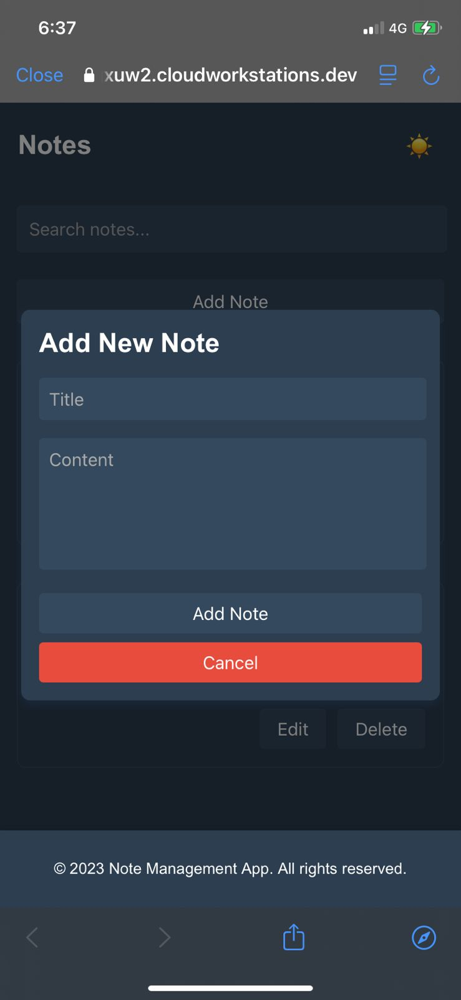
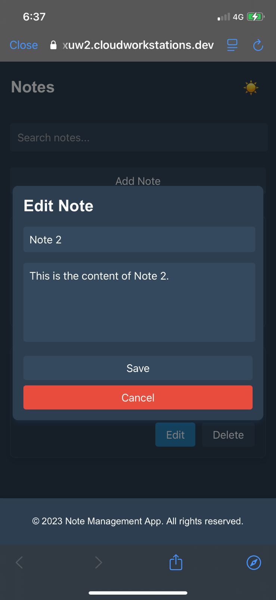

# Note Management App

A simple note-taking app built with React, TypeScript, and Vite. Features include:

- Add, edit, and delete notes.
- Light and dark theme support.
- Search functionality to filter notes.

## Preview:
<h2>Light & Dark mode</h2>
<div style="display: flex; flex-wrap: wrap; justify-content: space-between;">
  <div style="width: 32%; margin-bottom: 10px;">
    
  </div>
  <div style="width: 32%; margin-bottom: 10px;">
    
  </div>
  <div style="width: 32%; margin-bottom: 10px;">
    
  </div>
</div>
<div style="display: flex; flex-wrap: wrap; justify-content: space-between;">
  <div style="width: 32%; margin-bottom: 10px;">
    
  </div>
  <div style="width: 32%; margin-bottom: 10px;">
    
  </div>
  <div style="width: 32%; margin-bottom: 10px;">
    
  </div>
</div>


## Technologies Used
- React
- TypeScript
- Vite
- CSS Modules

## How to Run
1. Clone the repository:
```bash
   git clone https://github.com/eldoJr/note-management-app.git
```
2. Navigate to the project directory:
```bash
   cd note-management-app
   ```
3. Install the required dependencies, including Zustand:
```bash
   npm install
```
   ---
Happy hacking!